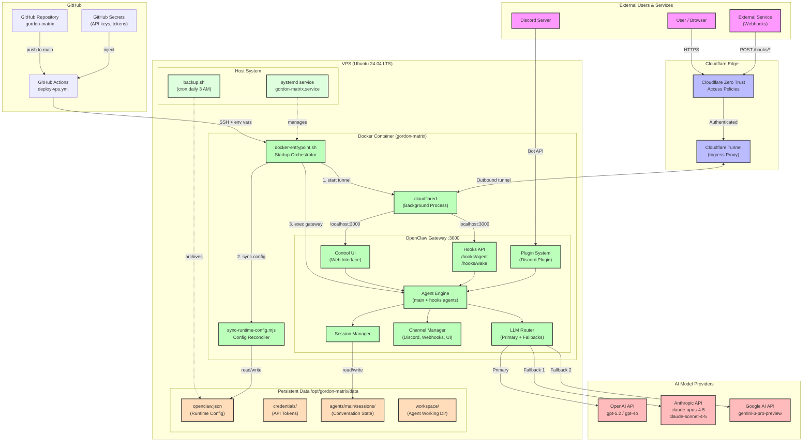
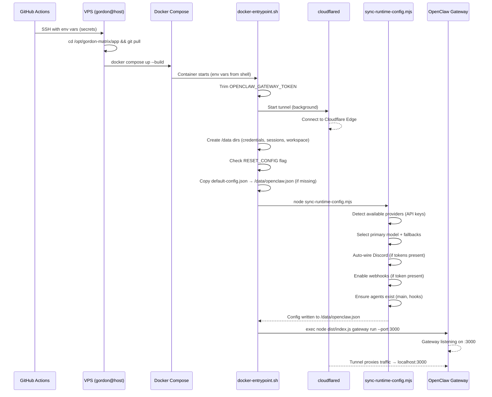
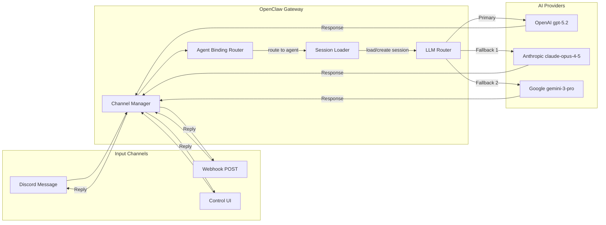

# Gordon Matrix - Repository Deep Dive

## What Is This Project?

**gordon-matrix** is a production-ready deployment template for [OpenClaw](https://openclaw.ai/) — an open-source AI agent platform — deployed to a **VPS (Ubuntu 24.04 LTS)** with enterprise-grade security via **Cloudflare Zero Trust**.

In plain terms: it's a turnkey recipe to get a self-hosted AI assistant ("Jarvis") running on your VPS, accessible through Discord, webhooks, or a web Control UI — all behind locked doors.

---

## Repository Structure

```
gordon-matrix/
├── .github/workflows/deploy-vps.yml   # CI/CD pipeline (GitHub Actions → VPS via SSH)
├── docs/
│   ├── agent/
│   │   ├── readme.md                   # Agent runtime playbook
│   │   └── env.md                      # Environment variable reference
│   ├── repository-deep-dive.md         # This document
│   └── vps-deployment-plan.md          # VPS deployment architecture reference
├── scripts/
│   └── sync-runtime-config.mjs         # Smart config sync (env vars → JSON config)
├── Dockerfile                          # Container build (Node 22, cloudflared, OpenClaw)
├── docker-entrypoint.sh                # Startup orchestrator
├── docker-compose.yml                  # VPS container orchestration
├── default-config.json                 # Default OpenClaw config template
├── backup.sh                           # Automated backup script
├── README.md                           # Quick-start guide
└── onboarding-and-operations.md        # Full operations runbook
```

---

## Key Components Explained

### 1. `Dockerfile` — Container Build
- Base: `node:22-bookworm` (Debian)
- Installs: Bun, pnpm, cloudflared, git, ripgrep, python3, vim
- Fetches OpenClaw source from GitHub (version configurable via `OPENCLAW_VERSION` build arg)
- Builds OpenClaw + its UI with `pnpm build` and `pnpm ui:build`
- Copies in the template's custom entrypoint, config, and sync script

### 2. `docker-entrypoint.sh` — Startup Orchestrator
Runs on every container start:
1. Trims whitespace from `OPENCLAW_GATEWAY_TOKEN` (prevents auth failures from copy/paste)
2. Starts **Cloudflare Tunnel** in background (if `CLOUDFLARE_TUNNEL_TOKEN` is set)
3. Creates persistent directories: `/data/credentials`, `/data/agents/main/sessions`, `/data/workspace`
4. Seeds workspace from `/root/.openclaw/workspace` if available
5. Handles one-shot config reset (`RESET_CONFIG=true`)
6. Copies `default-config.json` → `/data/openclaw.json` if missing
7. Runs `sync-runtime-config.mjs` to reconcile env vars into config
8. Hands off to the OpenClaw gateway process

### 3. `scripts/sync-runtime-config.mjs` — The Brain (15.6 KB)
The most substantial custom code. It's an **idempotent, additive** config reconciler:
- **Provider detection**: Scans for `OPENAI_API_KEY`, `ANTHROPIC_API_KEY`, `GEMINI_API_KEY`
- **Model selection**: Picks primary model based on available keys (OpenAI > Anthropic > Google priority)
- **Fallback chain**: Builds fallback models from all available providers
- **Discord auto-wiring**: If `DISCORD_BOT_TOKEN` + `DISCORD_GUILD_ID` are set → enables plugin, creates binding, configures channels
- **Webhook auto-enablement**: If `OPENCLAW_HOOKS_TOKEN` is set → enables `/hooks` endpoints
- **Safety**: Disables features if tokens are removed (safe-by-default)
- **Agent management**: Ensures `main` and `hooks` agents always exist

### 4. `default-config.json` — Config Template
```
Primary model:   openai/gpt-5.2
Fallbacks:       claude-opus-4-5, claude-sonnet-4-5, gpt-4o
Agents:          "main" (default), "hooks" (for webhooks)
Gateway:         port 3000, local mode
Hooks:           disabled by default
Max concurrent:  4 agent runs
Workspace:       /data/workspace
```

### 5. `docker-compose.yml` — VPS Container Orchestration
- Service: `openclaw`, container name: `gordon-matrix`
- Build arg: `OPENCLAW_VERSION` (default: `main`)
- Restart policy: `unless-stopped`
- Resource limits: 3 CPUs, 6GB RAM
- Volume: `/opt/gordon-matrix/data` → `/data`
- **No exposed ports** — intentionally private (container is accessed only via Cloudflare Tunnel)
- All external access goes through Cloudflare Tunnel
- Healthcheck: node fetch to `http://127.0.0.1:3000`
- Logging: journald driver with tag `gordon-matrix`
- Environment variables read from shell (passed via SSH from GitHub Secrets)

### 6. `.github/workflows/deploy-vps.yml` — CI/CD Pipeline
Triggers on push to `main` or manual dispatch. Steps:
1. Validates all required secrets are present (VPS connection, gateway token, tunnel token, at least one provider key)
2. Deploys via native SSH to VPS as `gordon` user:
   - Exports all GitHub Secrets as env vars in SSH session
   - Runs `git pull origin main`
   - Runs `docker compose up -d --build --remove-orphans`
   - Docker reads env vars from the shell and stores them internally
3. Logs warnings for missing optional features (Discord, webhooks)

**Secrets never touch the VPS disk as files.** They flow: GitHub Secrets → SSH env vars → Docker Compose → Docker internal storage (`/var/lib/docker/`, root-only).

### 7. `backup.sh` — Automated Backup Script
- Creates timestamped `tar.gz` of `/opt/gordon-matrix/data`
- Stores backups in `/opt/gordon-matrix/backups`
- Deletes backups older than 30 days
- Runs daily at 3:00 AM via `cron` (configured during VPS setup)

---

## Security Model

| Layer | Mechanism |
|-------|-----------|
| Network | No exposed ports; Cloudflare Tunnel (outbound-only) |
| Access control | Cloudflare Zero Trust Access policies |
| Gateway auth | `OPENCLAW_GATEWAY_TOKEN` for Control UI/WebSocket |
| Webhook auth | Bearer token (`OPENCLAW_HOOKS_TOKEN`) + CF Access headers |
| Secrets | GitHub Secrets → SSH env vars → Docker internal memory |
| File permissions | `/opt/gordon-matrix/data` at `chmod 700` (`gordon` user) |
| Process isolation | Docker container + dedicated `gordon` user on host |
| Auto-restart | systemd service (`gordon-matrix.service`) |

---

## Supported Integrations

| Integration | Required Env Vars | What It Does |
|-------------|-------------------|--------------|
| **OpenAI** | `OPENAI_API_KEY` | GPT-5.2 (primary), GPT-4o (fallback) |
| **Anthropic** | `ANTHROPIC_API_KEY` | Claude Opus 4.5, Claude Sonnet 4.5 |
| **Google** | `GEMINI_API_KEY` | Gemini 3 Pro Preview |
| **Discord** | `DISCORD_BOT_TOKEN` + `DISCORD_GUILD_ID` | Bot in Discord server channels |
| **Webhooks** | `OPENCLAW_HOOKS_TOKEN` | `/hooks/agent` and `/hooks/wake` endpoints |
| **Cloudflare** | `CLOUDFLARE_TUNNEL_TOKEN` | Secure tunnel ingress |
| **Control UI** | `OPENCLAW_GATEWAY_TOKEN` | Web-based management interface |

---

## Architecture Diagram



---

## Startup Sequence Diagram



---

## Request Flow Diagram



---

## Key Design Principles

1. **Private by default** — No exposed ports; everything behind Cloudflare Zero Trust
2. **Environment-driven config** — Set env vars, everything auto-wires (12-factor app)
3. **Idempotent startup** — Safe to restart anytime; config sync converges to correct state
4. **Graceful degradation** — Multi-provider LLM fallback chain (never "service unavailable")
5. **Stateful persistence** — Host directory survives container restarts (sessions, config, workspace)
6. **Safe-by-default** — Features stay disabled unless explicitly configured with tokens
7. **Single-command deploy** — Push to `main` → GitHub Actions handles everything via SSH
8. **Secrets in memory only** — GitHub Secrets → SSH env → Docker internal storage (never on VPS disk as files)

---

## File Sizes & Roles

| File | Size | Role |
|------|------|------|
| `scripts/sync-runtime-config.mjs` | 15.6 KB | Core logic — env-to-config reconciler |
| `.github/workflows/deploy-vps.yml` | ~6 KB | CI/CD pipeline with SSH deployment |
| `docker-entrypoint.sh` | 2.6 KB | Container startup orchestration |
| `Dockerfile` | 2.3 KB | Container build definition |
| `onboarding-and-operations.md` | ~10 KB | Full operations runbook (VPS) |
| `docker-compose.yml` | ~2 KB | VPS container orchestration |
| `default-config.json` | 0.8 KB | OpenClaw config template |
| `backup.sh` | ~0.2 KB | Daily backup script |
| `docs/agent/readme.md` | ~1 KB | Agent runtime playbook |
| `docs/agent/env.md` | ~1 KB | Environment reference |
